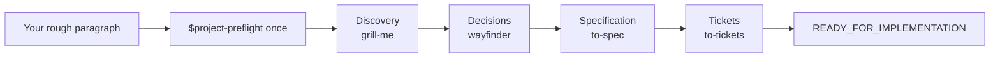

# Project Preflight

**English** | [简体中文](README.zh-CN.md)

[](https://github.com/NaCr05/project-preflight/actions/workflows/ci.yml)
[](LICENSE)
[](.codex-plugin/plugin.json)

> Invoke one Skill once. Turn a rough software idea into an evidence-backed, implementation-ready plan.

Project Preflight is a single-entry Codex Plugin. You invoke `$project-preflight`; it visibly coordinates discovery, architecture decisions, specification, and ticketing. You answer questions and confirm choices—you never copy a generated Skill command.

## Project status

Version 0.3.2 is available as public source. It is not yet a tagged GitHub Release or a public Plugin Directory listing.

| Distribution surface | Current status |
|---|---|
| Source repository | Public; anyone can inspect, fork, and install from source |
| GitHub Release | Not created; tagged release automation is prepared but has not been exercised |
| Public Plugin Directory | Not submitted or listed |
| Local end-to-end workflow | One complete real automatic-orchestration happy path recorded |

Creating a tag and submitting to the Plugin Directory remain separate maintainer decisions. See the [submission packet](docs/plugin-submission.md).

## Quick start from source

Until the public listing exists, anyone can go from this source repository to a first run in four steps.

1. In a terminal, clone the Plugin to a stable local path:

```text
git clone https://github.com/NaCr05/project-preflight.git <plugin-source-path>/project-preflight
```

2. In a Codex task, register that checkout:

```text
Use $plugin-creator to add the existing Plugin at <absolute-path>/project-preflight to my personal marketplace. Do not scaffold or overwrite the Plugin.
```

3. Back in the terminal, install it and confirm that it is enabled:

```text
codex plugin add project-preflight@personal
codex plugin list
```

4. Start a **new Codex task** and send one rough sentence:

```text
Use $project-preflight. I have a rough idea: an open-source assistant that turns long research papers into weekly action notes.
```

You are set when the list shows `project-preflight@personal` as installed and enabled at version `0.3.2` or newer, and the new task displays the Project Preflight Discovery banner followed by one question. From there, only answer or confirm; the Plugin keeps its progress in the active project's `.project/preflight.md` and advances automatically.

For prerequisites, troubleshooting, upgrades, and removal, continue to [Install](#install).

## What happens



At each Stage, Project Preflight names the active capability:

```text
Project Preflight · Discovery — Using `grill-me` (bundled Project Preflight adapter). Just answer or confirm.
```

The bundled Stage Adapter saves durable evidence and returns control automatically. Project Preflight checks the Gate, atomically updates `.project/preflight.md`, announces the next capability, and continues. It pauses only for your answer, a real blocker, cancellation, or readiness.

**[Read the complete workflow →](docs/workflow.md)**

## Install

### Public Plugin Directory

Project Preflight is not listed there yet. After an accepted public listing exists, install it from the Plugins tab in the ChatGPT desktop app or with `/plugins` in Codex CLI, then start a new task. See the [official Plugin user guide](https://learn.chatgpt.com/docs/plugins).

### Install from GitHub source

Requirements: Git, a Codex CLI version with `codex plugin`, and the built-in `$plugin-creator` Skill.

1. Clone the repository to a stable local path:

```text
git clone https://github.com/NaCr05/project-preflight.git <plugin-source-path>/project-preflight
```

2. In a Codex task, register that existing checkout with your personal marketplace:

```text
Use $plugin-creator to add the existing Plugin at <absolute-path>/project-preflight to my personal marketplace. Do not scaffold or overwrite the Plugin.
```

3. Install and verify it:

```text
codex plugin add project-preflight@personal
codex plugin list
```

The list should show `project-preflight@personal` as installed and enabled with version `0.3.2` or newer. Start a new task so Codex loads the newly installed Skills.

### Upgrade a source installation

```text
git -C <absolute-path>/project-preflight pull --ff-only
codex plugin add project-preflight@personal
codex plugin list
```

Start a new task after reinstalling. `pull --ff-only` stops on conflicting local work instead of overwriting it.

### Uninstall

```text
codex plugin remove project-preflight@personal
```

Uninstalling does not delete the source checkout or planning files already written to projects.

## Use

For a new idea:

```text
Use $project-preflight. I want to build an open-source tool that ...
```

For an existing project:

```text
Use $project-preflight to audit this project and continue from the earliest unsupported Gate.
```

The first message can be one immature sentence. Project Preflight does not expect a prepared plan.

## Four Gates and the endpoint

1. **Problem clarity** — user, problem, value, inputs, outputs, MVP, non-goals, assumptions, and measurable success are clear.
2. **Decision readiness** — architecture-reversing unknowns and feasibility risks are resolved or explicitly non-blocking.
3. **Specification readiness** — scope, behavior, boundaries, and verification are buildable and unambiguous.
4. **Execution readiness** — tickets are vertical, testable, correctly blocked, and begin with a tracer bullet.

Only Gate 4 produces `READY_FOR_IMPLEMENTATION`. The endpoint names the canonical spec, approved ticket set, first unblocked tracer bullet, verification path, and residual risks. Project Preflight does not write production application code.

## Architecture

```text
$project-preflight
  ├─ canonical Stage/Gate registry
  ├─ PreflightSession + StageOutcome → Gate/transition derivation, validation, atomic persistence
  ├─ Artifact Evidence Adapters → inline, local Markdown, GitHub Issue, generic URL
  ├─ Orchestration Directive → visible bundled Stage Adapter
  └─ Behavior Eval + Release Harness → reproducible verification and packaging
```

`PreflightSession.apply(StageOutcome)` is the primary lifecycle Interface: callers provide evidence and domain artifact updates, never a target Stage or Gate. The Module returns validated state and the next directive together. `_contract.py` remains canonical for finite lifecycle facts, and normative documentation blocks are exact projections checked in CI. Optional remote evidence checks share a Safe Remote Fetch Module that pins public addresses, revalidates redirects, bounds responses, and strips credentials across origins. Reachability never proves semantic Gate sufficiency.

The four internal Skills are namespaced to avoid collisions with separately installed Skills. See [ADR 0003](docs/decisions/0003-single-entry-automatic-orchestration-plugin.md), [third-party notices](THIRD_PARTY_NOTICES.md), and the [upstream review policy](docs/upstream-adapter-policy.md).

## Verification evidence

| Capability | Evidence level |
|---|---|
| Single-entry local-Markdown happy path | Verified in one real full run |
| Gate 1–4, regression, recovery, and failed-write preservation | Deterministic tests |
| English and Simplified Chinese Stage announcements | Deterministic tests |
| Safe read-only GitHub Issue and generic URL checks | Deterministic tests; network access remains opt-in |
| 5 positive + 3 negative submission cases | Manifest and deterministic scoring path prepared; fresh public-submission runs still required |
| Release archive reproducibility | Two-build byte-identical checksum test |
| GitHub tagged Release workflow | Defined but not yet exercised |
| Public Plugin Directory listing | Not submitted |

The recorded real high-reasoning happy path consumed approximately 108k model tokens and ten minutes. `evals/budgets.json` sets a 130k-token and 12-minute investigation threshold for comparable runs; it is a regression guardrail, not a cost promise.

## Develop and release-check

Run the repository-owned verification Interface:

```text
python scripts/release_harness.py verify
```

Build a deterministic candidate archive and SHA-256 record:

```text
python scripts/release_harness.py build --output dist
```

Maintainers must also run the official Codex Plugin validator and Skill Creator validation for every changed Skill. The tagged Release workflow uses the same Release Harness; it alone does not authorize a release.

See [CONTRIBUTING.md](CONTRIBUTING.md), [SUPPORT.md](SUPPORT.md), [SECURITY.md](SECURITY.md), [privacy](docs/privacy.md), [terms](docs/terms.md), [CHANGELOG.md](CHANGELOG.md), and the [knowledge authority map](docs/knowledge-map.json).

## Roadmap

- Add a real execution Adapter to the Behavior Eval Module while keeping deterministic scripted fixtures.
- Gather real usage evidence before deciding when the v0.3 low-level StateStore compatibility commands can be retired.
- Run the eight submission cases and a clean-install happy path against an approved release candidate.
- Publish stable support/privacy/terms URLs, enable private vulnerability reporting, and submit only after separate approval.

Remote tracker publishing and native programmatic Skill invocation remain deferred until real provider/runtime contracts justify those seams.

## Branch history and license

The validated explicit-Handoff experiment remains on `agent/handoff-state-lifecycle`; ADR 0003 supersedes its UX while retaining its proven lifecycle and evidence architecture.

MIT. See [LICENSE](LICENSE).
