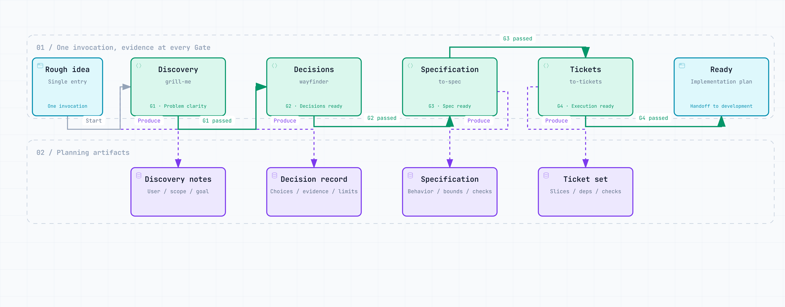
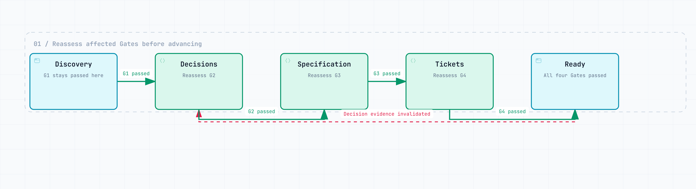

# Project Preflight

**English** | [简体中文](README.zh-CN.md)

[](https://github.com/NaCr05/project-preflight/actions/workflows/ci.yml)
[](LICENSE)
[](.codex-plugin/plugin.json)

> Invoke one Skill once. Turn a rough software idea into an evidence-backed, implementation-ready plan.

Project Preflight is a project-planning Plugin for Codex. Invoke `$project-preflight` to clarify the problem, settle key decisions, write a specification, and break the work into executable tickets. You answer questions and confirm choices; progress and evidence pointers are saved in `.project/preflight.md`.

A completed run gives you a specification, tickets, the first executable slice, and a verification path so you can move into development.

## What happens

Your rough idea moves through four Gates. Each Stage advances the plan and leaves evidence that later work can refer to.

<a href="docs/diagrams/assets/overview.en.png">
<picture>
  <source media="(prefers-color-scheme: dark)" srcset="docs/diagrams/assets/overview.en.dark.png">
  
</picture>
</a>

**Discovery → Decisions → Specification → Tickets → Ready.** Each Gate must pass before the next Stage begins; missing answers or evidence keep the current Stage active. Artifacts can use different carriers, and small projects may justify not needing a separate decision map.

`READY_FOR_IMPLEMENTATION` means the plan is ready for implementation. A subsequent implementation request starts development.

<details>
<summary>How progress is announced</summary>

At each Stage, Project Preflight names the active capability:

```text
Project Preflight · Discovery — Using `grill-me` (bundled Project Preflight adapter). Just answer or confirm.
```

Codex follows the orchestration directive to use the bundled Stage Skill. After receiving a Stage Outcome, the state module derives the Gate and next Stage, validates the result, and saves it. You do not need to invoke the four internal Skills yourself.

</details>

**[Read the complete workflow →](docs/workflow.md)**

## Real run: Feedback Compass

This example comes from the **2026-08-14 validation record**; the full run used Plugin **v0.3.0**. The current published version is v0.3.2.

A recorded validation used this original Chinese prompt, asking for an open-source tool to help independent developers prioritize features from user feedback:

```text
Use $project-preflight. 我想做一个帮独立开发者从用户反馈里找出最值得做功能的开源工具。
```

Project Preflight entered Discovery, named the active capability, asked exactly one focused question, and did not begin implementation. A separate installed-Plugin run then took the `feedback-compass` project through all four Stages in one invocation, with recommended defaults approved in advance:

```text
Discovery → Decision → Specification → Ticketing → Ready
```

It created five durable planning artifacts under `.project/`. Independent validation returned `VALID: READY_FOR_IMPLEMENTATION`: every Gate passed, every artifact pointer resolved, and no production source or application scaffold was created. The first ticket, `FC-001`, was an end-to-end CSV tracer bullet with offline verification.

**[Read the complete validation record →](evals/results-2026-08-14-automatic-orchestration.md)**

## Quick start from source

Until the public listing exists, anyone can go from this source repository to a first run in four steps.

1. In a terminal, clone the Plugin to a stable local path:

```text
git clone https://github.com/NaCr05/project-preflight.git <plugin-source-path>/project-preflight
```

2. In a Codex task, register that checkout:

```text
Use $plugin-creator to add the existing Plugin at <absolute-path>/project-preflight to my personal marketplace. Do not scaffold or overwrite the Plugin.
```

3. Back in the terminal, install it and confirm that it is enabled:

```text
codex plugin add project-preflight@personal
codex plugin list
```

4. Start a **new Codex task** and send one rough sentence:

```text
Use $project-preflight. I have a rough idea: an open-source assistant that turns long research papers into weekly action notes.
```

You are set when the list shows `project-preflight@personal` as installed and enabled at version `0.3.2` or newer, and the new task displays the Project Preflight Discovery banner followed by one question. From there, only answer or confirm; the Plugin keeps its progress in the active project's `.project/preflight.md` and advances automatically.

For prerequisites, troubleshooting, upgrades, and removal, continue to [Install](#install).

## Install

### Install the stable GitHub Release

Download `project-preflight-0.3.2.zip` and `project-preflight-0.3.2.sha256` from the [`v0.3.2` Release](https://github.com/NaCr05/project-preflight/releases/tag/v0.3.2). Verify the archive checksum, extract it to a stable directory, then register that directory with `$plugin-creator` and run `codex plugin add project-preflight@personal` as described in steps 2–3 of [Quick start from source](#quick-start-from-source). The Release archive contains only the installable Plugin and its runtime documentation.

### Public Plugin Directory

Project Preflight is not listed there yet. After an accepted public listing exists, install it from the Plugins tab in the ChatGPT desktop app or with `/plugins` in Codex CLI, then start a new task. See the [official Plugin user guide](https://learn.chatgpt.com/docs/plugins).

### Install from GitHub source

Requirements: Git, a Codex CLI version with `codex plugin`, and the built-in `$plugin-creator` Skill. Follow [Quick start from source](#quick-start-from-source) for installation and your first invocation.

<details>
<summary>Upgrade or uninstall</summary>

### Upgrade a source installation

```text
git -C <absolute-path>/project-preflight pull --ff-only
codex plugin add project-preflight@personal
codex plugin list
```

Start a new task after reinstalling. `pull --ff-only` stops on conflicting local work instead of overwriting it.

### Uninstall

```text
codex plugin remove project-preflight@personal
```

Uninstalling does not delete the source checkout or planning files already written to projects.

</details>

## Use

For a new idea:

```text
Use $project-preflight. I want to build an open-source tool that ...
```

For an existing project:

```text
Use $project-preflight to audit this project and continue from the earliest unsupported Gate.
```

The first message can be one immature sentence. Project Preflight does not expect a prepared plan.

## Four Gates and the endpoint

1. **Problem clarity** — user, problem, value, inputs, outputs, MVP, non-goals, assumptions, and measurable success are clear.
2. **Decision readiness** — architecture-reversing unknowns and feasibility risks are resolved or explicitly non-blocking.
3. **Specification readiness** — scope, behavior, boundaries, and verification are buildable and unambiguous.
4. **Execution readiness** — tickets are vertical, testable, correctly blocked, and begin with a tracer bullet.

Passing all four Gates produces `READY_FOR_IMPLEMENTATION`. The endpoint names the canonical spec, approved ticket set, first unblocked tracer bullet, verification path, and residual risks. Project Preflight does not write production application code.

## When evidence changes

Suppose the plan is Ready, then a key decision loses its supporting evidence. Project Preflight returns to **Decision**: unaffected G1 stays passed, G2–G4 become invalidated, and the decisions, specification, and tickets are reassessed.

<a href="docs/diagrams/assets/recovery.en.png">
<picture>
  <source media="(prefers-color-scheme: dark)" srcset="docs/diagrams/assets/recovery.en.dark.png">
  
</picture>
</a>

Previous artifacts remain visible, but affected evidence must be reassessed before it can support the plan again. Other kinds of invalidated evidence return the workflow to their earliest affected Stage.

When answers are missing, a blocker appears, or you pause, progress stays in `.project/preflight.md`. Continue through the same entry:

```text
Use $project-preflight to audit this project and continue from the earliest unsupported Gate.
```

**[Read the Stage and Gate rules →](skills/project-preflight/references/workflow.md)**

## Architecture

```text
$project-preflight
  ├─ canonical Stage/Gate registry
  ├─ PreflightSession + StageOutcome → Gate/transition derivation, validation, atomic persistence
  ├─ Artifact Evidence Adapters → inline, local Markdown, GitHub Issue, generic URL
  ├─ Orchestration Directive → visible bundled Stage Adapter
  └─ Behavior Eval + Release Harness → reproducible verification and packaging
```

`PreflightSession.apply(StageOutcome)` is the primary lifecycle Interface: callers provide evidence and domain artifact updates, never a target Stage or Gate. The Module returns validated state and the next directive together. `_contract.py` remains canonical for finite lifecycle facts, and normative documentation blocks are exact projections checked in CI. Optional remote evidence checks share a Safe Remote Fetch Module that pins public addresses, revalidates redirects, bounds responses, and strips credentials across origins. Reachability never proves semantic Gate sufficiency.

The four internal Skills are namespaced to avoid collisions with separately installed Skills. See [ADR 0003](docs/decisions/0003-single-entry-automatic-orchestration-plugin.md), [third-party notices](THIRD_PARTY_NOTICES.md), and the [upstream review policy](docs/upstream-adapter-policy.md).

## Verification evidence

| Capability | Evidence level |
|---|---|
| Single-entry local-Markdown happy path | Verified in one real full run |
| Gate 1–4, regression, recovery, and failed-write preservation | Deterministic tests |
| English and Simplified Chinese Stage announcements | Deterministic tests |
| Safe read-only GitHub Issue and generic URL checks | Deterministic tests; network access remains opt-in |
| 5 positive + 3 negative submission cases | Manifest and deterministic scoring path prepared; fresh public-submission runs still required |
| Release archive reproducibility | Two-build byte-identical checksum test |
| GitHub tagged Release workflow | Exercised for `v0.3.2`; archive and SHA-256 record published |
| Public Plugin Directory listing | Not submitted |

The recorded real high-reasoning happy path consumed approximately 108k model tokens and ten minutes. `evals/budgets.json` sets a 130k-token and 12-minute investigation threshold for comparable runs; it is a regression guardrail, not a cost promise.

## Project status

Version 0.3.2 is available as public source and a tagged GitHub Release. It is not listed in the public Plugin Directory.

| Distribution surface | Current status |
|---|---|
| Source repository | Public; anyone can inspect, fork, and install from source |
| GitHub Release | [`v0.3.2`](https://github.com/NaCr05/project-preflight/releases/tag/v0.3.2) with a deterministic archive and SHA-256 record |
| Public Plugin Directory | Not submitted or listed |
| Local end-to-end workflow | One complete real automatic-orchestration happy path recorded |

The repository is in [low-frequency maintenance](docs/maintenance.md). Public Plugin Directory submission remains a separate future milestone; see the [submission packet](docs/plugin-submission.md).

## Develop and release-check

Run the repository-owned verification Interface:

```text
python scripts/release_harness.py verify
```

Build a deterministic candidate archive and SHA-256 record:

```text
python scripts/release_harness.py build --output dist
```

Maintainers must also run the official Codex Plugin validator and Skill Creator validation for every changed Skill. The tagged Release workflow uses the same Release Harness; it alone does not authorize a release.

See [CONTRIBUTING.md](CONTRIBUTING.md), [SUPPORT.md](SUPPORT.md), [SECURITY.md](SECURITY.md), [maintenance status](docs/maintenance.md), [privacy](docs/privacy.md), [terms](docs/terms.md), [CHANGELOG.md](CHANGELOG.md), and the [knowledge authority map](docs/knowledge-map.json).

## Deferred roadmap

- Add a real execution Adapter to the Behavior Eval Module while keeping deterministic scripted fixtures.
- Gather real usage evidence before deciding when the v0.3 low-level StateStore compatibility commands can be retired.
- Run the eight fresh-context submission cases when an active Plugin Directory submission cycle begins.
- Submit to the public Plugin Directory only during an active maintenance cycle and after separate approval.

Remote tracker publishing and native programmatic Skill invocation remain deferred until real provider/runtime contracts justify those seams.

## Branch history and license

The validated explicit-Handoff experiment remains on `agent/handoff-state-lifecycle`; ADR 0003 supersedes its UX while retaining its proven lifecycle and evidence architecture.

MIT. See [LICENSE](LICENSE).
