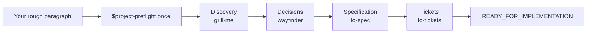

# Project Preflight

**English** | [简体中文](README.zh-CN.md)

[](https://github.com/NaCr05/project-preflight/actions/workflows/ci.yml)
[](LICENSE)
[](.codex-plugin/plugin.json)

> Invoke one Skill once. Turn a rough software idea into an evidence-backed, implementation-ready plan.

Project Preflight is a Codex Plugin with one public entry: `$project-preflight`. It automatically coordinates discovery, architecture decisions, specification, and ticketing. You never copy a generated Skill command; you only answer questions and confirm choices.

## What happens



At each Stage, Project Preflight tells you which capability is active. English and Simplified Chinese announcements share the same routing contract:

```text
Project Preflight · Discovery — Using `grill-me` (bundled Project Preflight adapter). Just answer or confirm.
```

The specialist Skill returns automatically after saving durable evidence. Project Preflight checks the Gate, atomically updates `.project/preflight.md`, announces the next Skill, and continues. It pauses only for your answer, a real blocker, cancellation, or readiness.

**[Read the complete workflow →](docs/workflow.md)**

## Install

### Public Plugin directory

After Project Preflight is published to the public Plugin directory, install it from the Plugins tab in the ChatGPT desktop app or enter `/plugins` in Codex CLI. Start a new task after installation so the bundled Skills are loaded. See the [official OpenAI Plugin guide](https://learn.chatgpt.com/docs/plugins).

### Install from GitHub source today

Requirements: Git, Codex CLI with `codex plugin` support, and the built-in `$plugin-creator` Skill.

While this repository is private, the GitHub account used by Git must have repository access. This requirement disappears after the repository is made public.

1. Clone the Plugin into your personal Plugin source directory:

```text
git clone https://github.com/NaCr05/project-preflight.git "$HOME/plugins/project-preflight"
```

2. In a Codex task, register the existing checkout with your personal marketplace:

```text
Use $plugin-creator to add the existing Plugin at <absolute-path-to>/plugins/project-preflight to my personal marketplace. Do not scaffold or overwrite the Plugin.
```

3. Install the registered Plugin:

```text
codex plugin add project-preflight@personal
```

4. Verify it and then start a new Codex task:

```text
codex plugin list
```

The list should show `project-preflight@personal` as `installed, enabled` with version `0.3.1` or newer.

### Upgrade a source installation

```text
git -C "$HOME/plugins/project-preflight" pull --ff-only
codex plugin add project-preflight@personal
codex plugin list
```

Start a new task after reinstalling. `pull --ff-only` intentionally stops when the checkout contains conflicting local work instead of overwriting it.

### Uninstall

```text
codex plugin remove project-preflight@personal
```

This uninstalls the Plugin but leaves the source checkout available for review or later reinstallation.

## Use

For a new idea:

```text
Use $project-preflight. I want to build an open-source tool that ...
```

For an existing project:

```text
Use $project-preflight to audit this project and continue from the earliest unsupported Gate.
```

The first message can be one immature sentence. Project Preflight does not expect a prepared plan.

## Four Gates

1. **Problem clarity** — user, problem, value, inputs, outputs, MVP, non-goals, assumptions, and measurable success are clear.
2. **Decision readiness** — architecture-reversing unknowns and feasibility risks are resolved or explicitly non-blocking.
3. **Specification readiness** — scope, behavior, boundaries, and verification are buildable and unambiguous.
4. **Execution readiness** — tickets are vertical, testable, correctly blocked, and begin with a tracer bullet.

Only Gate 4 produces `READY_FOR_IMPLEMENTATION`. Preflight ends with the canonical spec, approved tickets, first unblocked tracer bullet, verification path, and residual risks—not production code.

## State, safety, and architecture

`StateStore` keeps restricted YAML parsing, transitions, regression, validation, recovery, and atomic persistence behind one State lifecycle Interface. `_contract.py` is the canonical registry; marked normative documentation blocks are exact projections checked by CI.

Artifact Evidence uses dedicated Adapters for inline evidence, local Markdown, GitHub Issues, and generic URLs. Opt-in remote checks share one Safe Remote Fetch Module that pins approved public addresses, revalidates redirects, bounds responses, and strips credentials across origins. Reachability never proves semantic Gate sufficiency.

```text
skills/project-preflight/             public orchestrator + state runtime
skills/project-preflight-grill-me/    bundled discovery Adapter
skills/project-preflight-wayfinder/   bundled decision Adapter
skills/project-preflight-to-spec/     bundled specification Adapter
skills/project-preflight-to-tickets/  bundled ticketing Adapter
```

The internal Adapters are namespaced to avoid collisions with separately installed Skills. See [third-party notices](THIRD_PARTY_NOTICES.md), the [upstream review policy](docs/upstream-adapter-policy.md), and [ADR 0003](docs/decisions/0003-single-entry-automatic-orchestration-plugin.md).

## Verified and deferred

| Capability | Status |
|---|---|
| Single-entry automatic local-Markdown happy path | Verified |
| Gate 1–4, regression, recovery, and atomic-write preservation | Verified |
| English and Simplified Chinese Stage announcements | Deterministically tested |
| Safe read-only GitHub Issue and generic URL checks | Deterministically tested; remote access remains opt-in |
| Remote tracker publishing | Deferred |
| Native programmatic Skill invocation | Not provided by the runtime; orchestration is instruction-driven |
| Public Plugin directory listing | Not yet published |

The first full high-reasoning happy path consumed approximately 108k model tokens and ten minutes. `evals/budgets.json` sets a 130k-token and 12-minute regression ceiling for comparable runs. This is a regression guardrail, not the desired long-term cost profile.

## Develop and validate

```text
python -m compileall -q skills evals tests
python -m unittest discover -s tests -v
python skills/project-preflight/scripts/sync_contract.py --check
python skills/project-preflight/scripts/preflight_state.py template --check skills/project-preflight/assets/preflight-template.md
python evals/run_behavior_evals.py list
```

Also run the Codex Plugin validator on the repository root and Skill Creator validation on all five directories under `skills/` before release.

See [CONTRIBUTING.md](CONTRIBUTING.md), [SECURITY.md](SECURITY.md), [CHANGELOG.md](CHANGELOG.md), and the [product specification](docs/product-spec.md).

## Branch history

The validated explicit-Handoff experiment remains preserved on `agent/handoff-state-lifecycle`. ADR 0003 supersedes only its orchestration UX; the proven State lifecycle, evidence, regression, and eval architecture remain.

## License

MIT. See [LICENSE](LICENSE).
