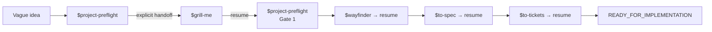

# Project Preflight

**English** | [简体中文](README.zh-CN.md)

> A gated pre-coding workflow orchestrator for AI coding agents.

`project-preflight` turns a vague software idea—or a partially planned project—into an evidence-backed implementation handoff. It detects the current stage, gives you the exact planning Skill command to invoke, validates the result when you return, persists progress across sessions, and stops production coding until the project is demonstrably ready.

## How it works



Project Preflight advances one evidence-backed Gate at a time. Each specialist Stage is a visible handoff: Project Preflight prints an exact `$skill-name` instruction, stops, and waits for you to invoke it. When its durable result exists, you explicitly resume `$project-preflight` for Gate evaluation. The endpoint is an implementation handoff—not completed product code.

**[Read the complete workflow guide →](docs/workflow.md)**

## Why this exists

Planning Skills are useful individually, but a project can still skip a step, lose state between sessions, duplicate decisions across documents, or treat the existence of a spec as proof of readiness. Project Preflight supplies the missing lifecycle:

- stage detection and resumption;
- explicit user-invoked handoffs instead of hidden Skill chaining;
- evidence-based gates;
- tracker-agnostic artifact pointers;
- scope and implementation guardrails;
- rollback when a technical assumption fails;
- a precise `READY_FOR_IMPLEMENTATION` handoff.

It orchestrates rather than replaces:

- `grill-me` for discovery;
- `wayfinder` for unresolved decisions;
- `to-spec` for specification synthesis;
- `to-tickets` for tracer-bullet tickets.

Those Skills are not bundled with this repository and retain their own behavior and licensing.

## Install locally

Copy `skills/project-preflight` into your Codex Skills directory as `project-preflight`. For example, place it under:

```text
<CODEX_HOME>/skills/project-preflight
```

Install the four upstream Skills separately and make sure they appear in the active Skill catalog. Project Preflight checks the current Stage dependency before emitting a handoff and stops with a useful blocker when explicit invocation is unavailable.

## Use it

Start from an idea:

```text
Use $project-preflight. I want to build an open-source agent that ...
```

Resume later:

```text
Use $project-preflight to resume this project's preflight.
```

Audit an existing plan:

```text
Use $project-preflight to determine whether this spec and ticket set are ready for implementation.
```

The Skill maintains one canonical state file in the target project:

```text
.project/preflight.md
```

The file records stage, gate status, blockers, and pointers to the canonical idea, decision map, spec, and ticket set. It does not duplicate those artifacts.

Project Preflight mutates this file through its bundled State lifecycle module. Candidate transitions are validated before an atomic replacement, so a failed update leaves the last valid state unchanged. Remote pointers produce explicit warnings; GitHub Issue pointers can also be checked read-only with `--check-remote`.

## Readiness gates

1. **Problem clarity** — user, problem, value, input, output, MVP, non-goals, and measurable success are clear.
2. **Decision readiness** — architecture-reversing unknowns and feasibility risks are resolved or explicitly non-blocking.
3. **Specification readiness** — scope, behavior, testing decisions, and open questions are precise enough to judge every proposed feature.
4. **Execution readiness** — tickets are vertical, testable, correctly blocked, scope-preserving, and include a first tracer bullet.

Only Gate 4 produces `READY_FOR_IMPLEMENTATION`.

## Repository layout

- `skills/project-preflight/` — the distributable Skill.
- `docs/product-spec.md` — v0.2 product scope and success criteria.
- `docs/workflow.md` — complete user journey, gates, artifacts, pauses, and rollback behavior.
- `docs/decisions/` — append-only architectural rationale.
- `tests/` — deterministic state-contract tests.
- `evals/` — machine-readable behavioral cases, isolated fixtures, reproducible scoring, and dated forward-test evidence.

## Validate changes

The validator uses only the Python standard library:

```text
python -m unittest discover -s tests -v
python skills/project-preflight/scripts/validate_preflight.py tests/fixtures/valid-idea.md --repo-root tests/fixtures
python skills/project-preflight/scripts/preflight_state.py template --check skills/project-preflight/assets/preflight-template.md
python evals/run_behavior_evals.py list
```

Run the Skill Creator `quick_validate.py` against `skills/project-preflight` to validate packaging metadata.

## Status

This repository now uses explicit Handoff orchestration plus a validated State lifecycle interface. Local Markdown remains the default; inline and local pointers are checked deterministically, GitHub Issue pointers have a real read adapter, and generic remote URLs are never silently treated as verified. Upstream publication behavior and automatic dependency installation remain intentionally separate.

## License

MIT. See `LICENSE`.
