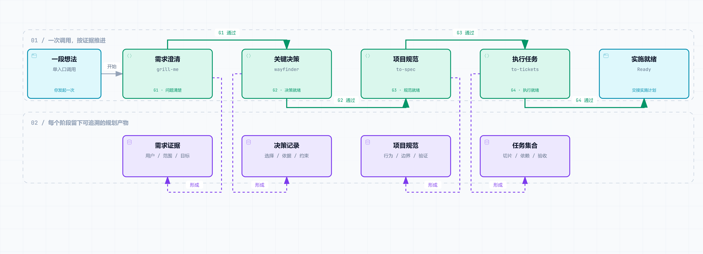
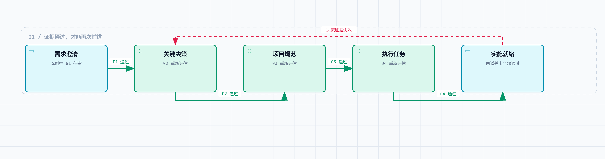

# Project Preflight

[English](README.md) | **简体中文**

[](https://github.com/NaCr05/project-preflight/actions/workflows/ci.yml)
[](LICENSE)
[](.codex-plugin/plugin.json)

> 只调用一次，把一段模糊的软件想法推进成有证据、可实施的计划。

Project Preflight 是一个用于 Codex 的项目启动规划 Plugin。调用 `$project-preflight`，它会引导你澄清问题、确认关键决策、形成项目规范并拆成可执行任务。你负责回答问题和确认选择，进度与证据指针保存在 `.project/preflight.md`。

完成后，你会拿到规范、任务、首个可执行切片和验证路径，可以接着进入开发。

## 实际流程

你的一段想法会依次经过四道关卡。每个阶段既推进计划，也留下后续工作可以引用的依据。

<a href="docs/diagrams/assets/overview.zh-CN.png">
<picture>
  <source media="(prefers-color-scheme: dark)" srcset="docs/diagrams/assets/overview.zh-CN.dark.png">
  
</picture>
</a>

**需求澄清 → 关键决策 → 项目规范 → 执行任务 → 实施就绪。** 每道关卡通过后才继续；缺少回答或证据时，停留在当前阶段。产物可采用不同载体，小项目可按契约说明无需独立决策图。

`READY_FOR_IMPLEMENTATION` 表示规划就绪，交付的是实施计划；后续开发由新的实施请求启动。

<details>
<summary>运行时如何提示进度</summary>

进入每个阶段时，Project Preflight 都会提示当前能力：

```text
Project Preflight · Discovery — 正在使用 `grill-me`（Project Preflight 内置适配器）。你只需回答或确认。
```

Codex 按编排指令使用内置阶段 Skill。阶段结果提交给状态模块后，由模块推导关卡和后续阶段、校验并保存状态；你不需要手动调用四个内部 Skill。

</details>

**[阅读完整流程 →](docs/workflow.zh-CN.md)**

## 真实运行：Feedback Compass

以下案例来自 **2026-08-14 的留档验证**；其中完整流程使用 Plugin **v0.3.0**。当前仓库发布版为 v0.3.2。

一次留档验证从这句模糊想法开始：

```text
Use $project-preflight. 我想做一个帮独立开发者从用户反馈里找出最值得做功能的开源工具。
```

Project Preflight 进入 Discovery，明确显示当前能力，只提出一个聚焦问题，且没有开始实现。另一轮已安装 Plugin 的完整运行，在预先批准推荐默认项后，通过一次调用，把 `feedback-compass` 项目依次推进到四个阶段和最终就绪状态：

```text
Discovery → Decision → Specification → Ticketing → Ready
```

它在 `.project/` 下生成了五份持久化规划工件。独立验证返回 `VALID: READY_FOR_IMPLEMENTATION`：四道 Gate 全部通过，所有工件指针都能解析，且项目中没有生成生产源码或应用脚手架。首张任务单 `FC-001` 是一个带离线验证方式的端到端 CSV tracer bullet。

**[阅读完整验证记录 →](evals/results-2026-08-14-automatic-orchestration.md)**

## 从源码快速开始

正式上架公共目录前，任何人都可以用四步从这个源码仓库完成安装和首次体验。

1. 在终端中，把 Plugin 克隆到一个稳定的本地路径：

```text
git clone https://github.com/NaCr05/project-preflight.git <plugin-source-path>/project-preflight
```

2. 在一个 Codex 任务中，登记这份本地源码：

```text
Use $plugin-creator to add the existing Plugin at <绝对路径>/project-preflight to my personal marketplace. Do not scaffold or overwrite the Plugin.
```

3. 回到终端，安装并确认 Plugin 已启用：

```text
codex plugin add project-preflight@personal
codex plugin list
```

4. **新建一个 Codex 任务**，发送一句模糊想法：

```text
Use $project-preflight. 我有一个模糊想法：做一个开源助手，把很长的研究论文转成每周行动笔记。
```

当列表显示 `project-preflight@personal` 已安装并启用、版本为 `0.3.2` 或更高，并且新任务先显示 Project Preflight 的 Discovery 阶段提示、再提出一个问题时，就说明已经成功运行。接下来只需回答或确认；Plugin 会把进度保存在当前项目的 `.project/preflight.md` 中，并自动推进。

前提条件、故障排查、升级和卸载说明见[安装](#安装)。

## 安装

### 安装稳定版 GitHub Release

从 [`v0.3.2` Release](https://github.com/NaCr05/project-preflight/releases/tag/v0.3.2) 下载 `project-preflight-0.3.2.zip` 和 `project-preflight-0.3.2.sha256`。校验压缩包 checksum，解压到稳定目录，然后按[从源码快速开始](#从源码快速开始)的第 2–3 步，用 `$plugin-creator` 登记该目录，并运行 `codex plugin add project-preflight@personal`。Release 压缩包只包含可安装 Plugin 及其运行文档。

### 公共 Plugin Directory

Project Preflight 目前尚未上架。正式通过公开上架后，可以在 ChatGPT 桌面应用的 Plugins 页面安装，或在 Codex CLI 输入 `/plugins`，然后新建任务。参见 [OpenAI 官方 Plugin 使用指南](https://learn.chatgpt.com/docs/plugins)。

### 从 GitHub 源码安装

前提：已安装 Git、Codex CLI 支持 `codex plugin`，并且可以使用内置 `$plugin-creator` Skill。安装与首次调用步骤见[从源码快速开始](#从源码快速开始)。

<details>
<summary>升级与卸载</summary>

### 升级源码安装

```text
git -C <绝对路径>/project-preflight pull --ff-only
codex plugin add project-preflight@personal
codex plugin list
```

重新安装后请新建任务。`pull --ff-only` 遇到冲突的本地改动会停止，不会覆盖它们。

### 卸载

```text
codex plugin remove project-preflight@personal
```

卸载不会删除源码目录，也不会删除已经写入项目的规划文件。

</details>

## 使用

新想法：

```text
Use $project-preflight. 我想做一个开源工具，它可以……
```

已有项目：

```text
Use $project-preflight 检查这个项目，并从最早缺少证据的 Gate 继续。
```

第一条消息可以只是一句很不成熟的想法，Project Preflight 不要求你先写计划。

## 四道 Gate 与终点

1. **问题清晰** — 用户、问题、价值、输入输出、MVP、非目标、假设和可量化成功标准清楚。
2. **决策就绪** — 会改变架构方向的未知项和可行性风险已解决，或明确为非阻塞。
3. **规范就绪** — 范围、行为、边界和验证方式足够明确，可以实施。
4. **执行就绪** — Ticket 纵向、可测试、依赖清晰，并从最薄的 tracer bullet 开始。

四道 Gate 全部通过后才会进入 `READY_FOR_IMPLEMENTATION`。终点会列出规范、已批准 Ticket、首个未阻塞 tracer bullet、验证路径和剩余风险。Project Preflight 不会编写生产应用代码。

## 证据变化时如何继续

例如，计划已经实施就绪，随后发现关键决策依据不再成立。Project Preflight 会回到 **Decision**：本例保留未受影响的 G1，将 G2–G4 标为失效，重新检查决策、规范和任务。

<a href="docs/diagrams/assets/recovery.zh-CN.png">
<picture>
  <source media="(prefers-color-scheme: dark)" srcset="docs/diagrams/assets/recovery.zh-CN.dark.png">
  
</picture>
</a>

原有产物仍可查看，受影响的依据需要重新评估后才能继续使用。失效来自其他类型的证据时，会回到相应的最早受影响阶段。

缺少回答、遇到阻塞或主动暂停时，进度保存在 `.project/preflight.md`；继续工作时仍使用同一个入口：

```text
Use $project-preflight 检查这个项目，并从最早缺少证据的 Gate 继续。
```

**[查看阶段与关卡规则 →](skills/project-preflight/references/workflow.md)**

## 架构

```text
$project-preflight
  ├─ canonical Stage/Gate registry
  ├─ PreflightSession + StageOutcome → Gate/推进回退推导、验证、原子持久化
  ├─ Artifact Evidence Adapters → inline、本地 Markdown、GitHub Issue、通用 URL
  ├─ Orchestration Directive → 用户可见的内置 Stage Adapter
  └─ Behavior Eval + Release Harness → 可复现验证与打包
```

`PreflightSession.apply(StageOutcome)` 是主要生命周期 Interface：调用方只提交证据和领域 artifact 更新，不再提供目标 Stage 或 Gate；Module 会同时返回已验证状态和下一条 directive。`_contract.py` 继续作为有限生命周期事实的 canonical source，规范文档中的标记区块由它精确投影，并由 CI 检查。可选的远程证据检查共用 Safe Remote Fetch Module：固定公网地址、逐跳复检重定向、限制响应，并在跨域时移除凭据。链接可访问不等于证据足以通过 Gate。

四个内部 Skill 使用命名空间，避免与单独安装的 Skill 冲突。参见 [ADR 0003](docs/decisions/0003-single-entry-automatic-orchestration-plugin.md)、[第三方声明](THIRD_PARTY_NOTICES.md)和[上游审查策略](docs/upstream-adapter-policy.md)。

## 验证证据

| 能力 | 证据级别 |
|---|---|
| 单入口、本地 Markdown happy path | 一次真实完整流程已验证 |
| Gate 1–4、回退、恢复、失败写入保护 | 确定性测试 |
| 英文与简体中文阶段提示 | 确定性测试 |
| GitHub Issue 与通用 URL 的安全只读检查 | 确定性测试；联网仍需显式开启 |
| 5 个正向 + 3 个负向提交案例 | 已准备清单和确定性评分路径；正式提交前仍需新上下文实跑 |
| 发布压缩包可复现性 | 两次构建字节级 checksum 一致测试 |
| GitHub 带 tag Release 工作流 | 已用于 `v0.3.2`；压缩包和 SHA-256 记录已发布 |
| 公共 Plugin Directory | 尚未提交 |

已记录的高推理真实 happy path 大约消耗 108k model tokens、10 分钟。`evals/budgets.json` 为同类运行设置 130k tokens 和 12 分钟的调查阈值；它是回归警戒线，不是费用承诺。

## 项目现状

0.3.2 已作为公开源码和带 tag 的 GitHub Release 提供，但尚未上架公共 Plugin Directory。

| 分发渠道 | 当前状态 |
|---|---|
| 源码仓库 | 已公开；任何人都可以查看、fork 并从源码安装 |
| GitHub Release | 已发布 [`v0.3.2`](https://github.com/NaCr05/project-preflight/releases/tag/v0.3.2)，包含可复现压缩包和 SHA-256 记录 |
| 公共 Plugin Directory | 尚未提交、尚未上架 |
| 本地端到端流程 | 已记录一次完整、真实、自动编排的 happy path |

仓库现已进入[低频维护状态](docs/maintenance.md)。提交公共 Plugin Directory 仍是未来独立里程碑，详见[提交准备包](docs/plugin-submission.md)。

## 开发与发布检查

运行仓库统一的验证入口：

```text
python scripts/release_harness.py verify
```

生成可复现候选压缩包和 SHA-256 文件：

```text
python scripts/release_harness.py build --output dist
```

维护者还必须运行官方 Codex Plugin validator，并对每个有改动的 Skill 运行 Skill Creator 校验。带 tag 的 Release 工作流也使用同一个 Release Harness，但工作流存在不代表已经授权发布。

继续阅读：[贡献指南](CONTRIBUTING.md)、[支持说明](SUPPORT.md)、[安全策略](SECURITY.md)、[维护状态](docs/maintenance.md)、[隐私说明](docs/privacy.md)、[使用条款](docs/terms.md)、[变更记录](CHANGELOG.md)和[知识权威表](docs/knowledge-map.json)。

## 暂缓路线图

- 为 Behavior Eval Module 加入真实执行 Adapter，同时保留确定性 scripted fixtures。
- 先收集真实使用证据，再决定何时移除 v0.3 的底层 StateStore 兼容命令。
- 进入活跃的 Plugin Directory 提交周期时，再实跑八个新上下文提交案例。
- 仅在恢复活跃维护且获得单独批准后，提交公共 Plugin Directory。

远程 tracker 写入和 Python 原生调用 Skill 继续暂缓，直到真实的 provider/runtime contract 足以支撑这些 seam。

## 分支历史与许可证

已验证的显式 Handoff 实验保留在 `agent/handoff-state-lifecycle`。ADR 0003 取代其 UX，但保留已验证的 lifecycle 与 evidence 架构。

MIT，详见 [LICENSE](LICENSE)。
