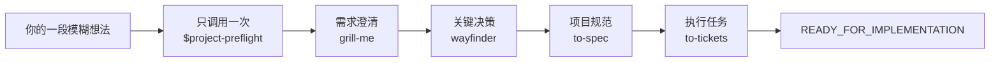

# Project Preflight

[English](README.md) | **简体中文**

[](https://github.com/NaCr05/project-preflight/actions/workflows/ci.yml)
[](LICENSE)
[](.codex-plugin/plugin.json)

> 只调用一次，把一段模糊的软件想法推进成有证据、可实施的计划。

Project Preflight 是一个单入口 Codex Plugin。你只需调用 `$project-preflight`；它会明确提示当前能力，并自动协调需求澄清、架构决策、规范生成和任务拆分。你只回答问题和确认选择，不需要复制任何 Skill 指令。

## 项目现状

0.3.2 是面向公开发布准备的**源码候选版**，不是已经公开发布的声明。

| 分发渠道 | 当前状态 |
|---|---|
| 源码仓库 | Public-ready 改动审查期间仍为私有；有 GitHub 权限的用户可从源码安装 |
| GitHub Release | 尚未创建；已准备带 tag 的自动发布流程，但尚未实际运行 |
| 公共 Plugin Directory | 尚未提交、尚未上架 |
| 本地端到端流程 | 已记录一次完整、真实、自动编排的 happy path |

公开仓库、创建 tag、提交 Plugin Directory 是三个独立的维护者决策。详见[提交准备包](docs/plugin-submission.md)。

## 从源码快速开始

正式上架公共目录前，拥有仓库权限的用户可以用四步完成源码安装和首次体验。

1. 在终端中，把 Plugin 克隆到一个稳定的本地路径：

```text
git clone https://github.com/NaCr05/project-preflight.git <plugin-source-path>/project-preflight
```

2. 在一个 Codex 任务中，登记这份本地源码：

```text
Use $plugin-creator to add the existing Plugin at <绝对路径>/project-preflight to my personal marketplace. Do not scaffold or overwrite the Plugin.
```

3. 回到终端，安装并确认 Plugin 已启用：

```text
codex plugin add project-preflight@personal
codex plugin list
```

4. **新建一个 Codex 任务**，发送一句模糊想法：

```text
Use $project-preflight. 我有一个模糊想法：做一个开源助手，把很长的研究论文转成每周行动笔记。
```

当列表显示 `project-preflight@personal` 已安装并启用、版本为 `0.3.2` 或更高，并且新任务先显示 Project Preflight 的 Discovery 阶段提示、再提出一个问题时，就说明已经成功运行。接下来只需回答或确认；Plugin 会把进度保存在当前项目的 `.project/preflight.md` 中，并自动推进。

前提条件、故障排查、升级和卸载说明见[安装](#安装)。

## 实际流程



进入每个阶段时，Project Preflight 都会提示当前能力：

```text
Project Preflight · Discovery — 正在使用 `grill-me`（Project Preflight 内置适配器）。你只需回答或确认。
```

内置 Stage Adapter 保存持久化证据后，会自动把控制权交还给 Project Preflight。随后它检查 Gate、原子更新 `.project/preflight.md`、提示下一项能力并继续。流程只会因为等待你的回答、真实阻塞、主动取消或已经就绪而暂停。

**[阅读完整流程 →](docs/workflow.zh-CN.md)**

## 安装

### 公共 Plugin Directory

Project Preflight 目前尚未上架。正式通过公开上架后，可以在 ChatGPT 桌面应用的 Plugins 页面安装，或在 Codex CLI 输入 `/plugins`，然后新建任务。参见 [OpenAI 官方 Plugin 使用指南](https://learn.chatgpt.com/docs/plugins)。

### 从 GitHub 源码安装

前提：已安装 Git、Codex CLI 支持 `codex plugin`、仓库仍为私有时拥有访问权限，并且可以使用内置 `$plugin-creator` Skill。

1. 把仓库克隆到一个稳定的本地路径：

```text
git clone https://github.com/NaCr05/project-preflight.git <plugin-source-path>/project-preflight
```

2. 在 Codex 任务中，把已有目录登记到个人 Marketplace：

```text
Use $plugin-creator to add the existing Plugin at <绝对路径>/project-preflight to my personal marketplace. Do not scaffold or overwrite the Plugin.
```

3. 安装并验证：

```text
codex plugin add project-preflight@personal
codex plugin list
```

列表中应显示 `project-preflight@personal` 已安装并启用，版本为 `0.3.2` 或更高。随后新建任务，让 Codex 加载新安装的 Skills。

### 升级源码安装

```text
git -C <绝对路径>/project-preflight pull --ff-only
codex plugin add project-preflight@personal
codex plugin list
```

重新安装后请新建任务。`pull --ff-only` 遇到冲突的本地改动会停止，不会覆盖它们。

### 卸载

```text
codex plugin remove project-preflight@personal
```

卸载不会删除源码目录，也不会删除已经写入项目的规划文件。

## 使用

新想法：

```text
Use $project-preflight. 我想做一个开源工具，它可以……
```

已有项目：

```text
Use $project-preflight 检查这个项目，并从最早缺少证据的 Gate 继续。
```

第一条消息可以只是一句很不成熟的想法，Project Preflight 不要求你先写计划。

## 四道 Gate 与终点

1. **问题清晰** — 用户、问题、价值、输入输出、MVP、非目标、假设和可量化成功标准清楚。
2. **决策就绪** — 会改变架构方向的未知项和可行性风险已解决，或明确为非阻塞。
3. **规范就绪** — 范围、行为、边界和验证方式足够明确，可以实施。
4. **执行就绪** — Ticket 纵向、可测试、依赖清晰，并从最薄的 tracer bullet 开始。

只有 Gate 4 通过后才会进入 `READY_FOR_IMPLEMENTATION`。终点会列出规范、已批准 Ticket、首个未阻塞 tracer bullet、验证路径和剩余风险。Project Preflight 不会编写生产应用代码。

## 架构

```text
$project-preflight
  ├─ canonical Stage/Gate registry
  ├─ PreflightSession + StageOutcome → Gate/推进回退推导、验证、原子持久化
  ├─ Artifact Evidence Adapters → inline、本地 Markdown、GitHub Issue、通用 URL
  ├─ Orchestration Directive → 用户可见的内置 Stage Adapter
  └─ Behavior Eval + Release Harness → 可复现验证与打包
```

`PreflightSession.apply(StageOutcome)` 是主要生命周期 Interface：调用方只提交证据和领域 artifact 更新，不再提供目标 Stage 或 Gate；Module 会同时返回已验证状态和下一条 directive。`_contract.py` 继续作为有限生命周期事实的 canonical source，规范文档中的标记区块由它精确投影，并由 CI 检查。可选的远程证据检查共用 Safe Remote Fetch Module：固定公网地址、逐跳复检重定向、限制响应，并在跨域时移除凭据。链接可访问不等于证据足以通过 Gate。

四个内部 Skill 使用命名空间，避免与单独安装的 Skill 冲突。参见 [ADR 0003](docs/decisions/0003-single-entry-automatic-orchestration-plugin.md)、[第三方声明](THIRD_PARTY_NOTICES.md)和[上游审查策略](docs/upstream-adapter-policy.md)。

## 验证证据

| 能力 | 证据级别 |
|---|---|
| 单入口、本地 Markdown happy path | 一次真实完整流程已验证 |
| Gate 1–4、回退、恢复、失败写入保护 | 确定性测试 |
| 英文与简体中文阶段提示 | 确定性测试 |
| GitHub Issue 与通用 URL 的安全只读检查 | 确定性测试；联网仍需显式开启 |
| 5 个正向 + 3 个负向提交案例 | 已准备清单和确定性评分路径；正式提交前仍需新上下文实跑 |
| 发布压缩包可复现性 | 两次构建字节级 checksum 一致测试 |
| GitHub 带 tag Release 工作流 | 已定义，尚未实际运行 |
| 公共 Plugin Directory | 尚未提交 |

已记录的高推理真实 happy path 大约消耗 108k model tokens、10 分钟。`evals/budgets.json` 为同类运行设置 130k tokens 和 12 分钟的调查阈值；它是回归警戒线，不是费用承诺。

## 开发与发布检查

运行仓库统一的验证入口：

```text
python scripts/release_harness.py verify
```

生成可复现候选压缩包和 SHA-256 文件：

```text
python scripts/release_harness.py build --output dist
```

维护者还必须运行官方 Codex Plugin validator，并对每个有改动的 Skill 运行 Skill Creator 校验。带 tag 的 Release 工作流也使用同一个 Release Harness，但工作流存在不代表已经授权发布。

继续阅读：[贡献指南](CONTRIBUTING.md)、[支持说明](SUPPORT.md)、[安全策略](SECURITY.md)、[隐私说明](docs/privacy.md)、[使用条款](docs/terms.md)、[变更记录](CHANGELOG.md)和[知识权威表](docs/knowledge-map.json)。

## 路线图

- 为 Behavior Eval Module 加入真实执行 Adapter，同时保留确定性 scripted fixtures。
- 先收集真实使用证据，再决定何时移除 v0.3 的底层 StateStore 兼容命令。
- 对批准的发布候选版实跑八个提交案例和一次干净安装 happy path。
- 发布稳定的支持、隐私、条款 URL，启用私密漏洞报告，并在单独批准后提交上架。

远程 tracker 写入和 Python 原生调用 Skill 继续暂缓，直到真实的 provider/runtime contract 足以支撑这些 seam。

## 分支历史与许可证

已验证的显式 Handoff 实验保留在 `agent/handoff-state-lifecycle`。ADR 0003 取代其 UX，但保留已验证的 lifecycle 与 evidence 架构。

MIT，详见 [LICENSE](LICENSE)。
