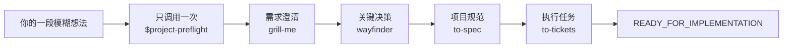

# Project Preflight

[English](README.md) | **简体中文**

> 只调用一次，把一段模糊的软件想法推进成有证据、可实施的计划。

Project Preflight 是一个只有一个公开入口的 Codex Plugin：`$project-preflight`。它会自动协调需求澄清、架构决策、规范生成和任务拆分。你不需要复制任何 Skill 指令，只需要回答问题和确认选择。

## 实际体验



进入每个阶段时，Project Preflight 都会告诉你当前正在使用什么能力。短名称是用户熟悉的能力名，实际执行仍由 Plugin 内部带命名空间的适配器完成：

```text
Project Preflight · Discovery — 正在使用 `grill-me`（Project Preflight 内置适配器）。你只需回答或确认。
```

专项 Skill 保存持久化证据后，会在同一个任务里自动把控制权交还给 Project Preflight。随后它检查 Gate、原子更新 `.project/preflight.md`、提示下一个 Skill 并继续。流程只会因为等待你的回答、真实阻塞、你主动取消或已经就绪而暂停。

**[阅读完整流程 →](docs/workflow.zh-CN.md)**

## 四道 Gate

1. **问题清晰** — 用户、问题、价值、输入输出、MVP、非目标、假设和可量化成功标准清楚。
2. **决策就绪** — 会改变架构方向的未知项和可行性风险已解决，或明确为非阻塞。
3. **规范就绪** — 范围、行为、边界和验证方式足够明确，可以实施。
4. **执行就绪** — Ticket 是纵向、可测试、依赖清晰的，并从最薄的 tracer bullet 开始。

只有 Gate 4 通过后才会进入 `READY_FOR_IMPLEMENTATION`。终点是规范、Ticket、首个 tracer bullet、验证路径和剩余风险组成的实施交接，不是生产代码。

## Plugin 架构

- `skills/project-preflight/` — 唯一用户入口和状态运行时。
- `skills/project-preflight-grill-me/` — 内置需求澄清适配器。
- `skills/project-preflight-wayfinder/` — 内置决策适配器。
- `skills/project-preflight-to-spec/` — 内置规范适配器。
- `skills/project-preflight-to-tickets/` — 内置任务拆分适配器。
- `.codex-plugin/plugin.json` — Codex Plugin 清单。
- `docs/decisions/0003-single-entry-automatic-orchestration-plugin.md` — 当前架构决策。

适配器使用命名空间，避免和用户单独安装的同名 Skill 冲突。上游启发和署名见 [第三方声明](THIRD_PARTY_NOTICES.md)。

## 使用

```text
Use $project-preflight. 我想做一个开源工具，它可以……
```

第一条消息可以只是一句很不成熟的想法，Project Preflight 不要求你先写计划。

已有项目也可以直接审计：

```text
Use $project-preflight 检查这个项目，并从最早缺少证据的 Gate 继续。
```

## 状态与安全

`.project/preflight.md` 保存阶段、Gate、阻塞项和规范产物指针。解析、推进、回退、验证、恢复和原子写入共用同一个 State lifecycle interface。远程链接会返回明确的 evidence-adapter 结果，不会被静默当作已验证。

达到 readiness 前禁止实现生产功能。如果新证据推翻了决策，流程会回退到最早受影响的阶段，自动恢复对应 Skill，并把后续产物保留为历史而非当前事实。

## 验证改动

```text
python -m unittest discover -s tests -v
python skills/project-preflight/scripts/preflight_state.py template --check skills/project-preflight/assets/preflight-template.md
python evals/run_behavior_evals.py list
```

同时对仓库根目录运行 Codex Plugin validator，并对 `skills/` 下的每个 Skill 运行 Skill Creator 校验。

## 分支历史

已验证的显式 Handoff 实验保留在 `agent/handoff-state-lifecycle`。当前分支只替换编排体验；已经验证过的状态生命周期、证据适配器、回退和评测架构继续保留。

## 许可证

MIT，详见 [LICENSE](LICENSE)。
