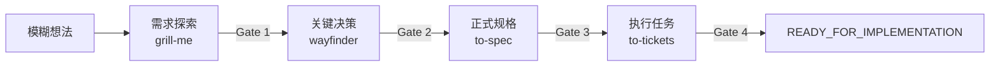

# Project Preflight

[English](README.md) | **简体中文**

> 面向 AI 编码智能体、带阶段闸门的编码前工作流编排器。

`project-preflight` 将一个模糊的软件想法或尚未完成规划的项目，推进为一份有证据支撑的实施交接。它会识别项目当前所处阶段，将工作路由到兼容的规划 Skill，跨会话保存进度，并在项目被证明已经准备就绪之前阻止生产代码开发。

## 工作流程



Project Preflight 每次只推进一个有证据支持的 Gate。你仍然负责产品和架构判断；Codex 负责采访、绘制决策地图、综合已批准的 Spec，并提出可审查的 Ticket Frontier。终点是可靠的实施交接，而不是已经写完的产品代码。

**[查看完整中文流程指南 →](docs/workflow.zh-CN.md)**

## 为什么需要它

单独使用规划 Skill 很有帮助，但项目依然可能跳过阶段、在会话之间丢失状态、在多份文档中重复维护决策，或者误把“已经有 Spec”当成“已经可以开发”。Project Preflight 补齐了这条生命周期：

- 阶段识别与断点恢复；
- 基于证据的 Gate；
- 不绑定具体 Issue Tracker 的产物指针；
- 范围与实施防护规则；
- 核心技术假设失效后的回退机制；
- 精确的 `READY_FOR_IMPLEMENTATION` 实施交接。

它负责编排，而不是替代：

- 使用 `grill-me` 完成需求探索；
- 使用 `wayfinder` 解决尚未完成的关键决策；
- 使用 `to-spec` 综合生成项目规格；
- 使用 `to-tickets` 生成 Tracer Bullet Tickets。

这些上游 Skill 不随本仓库打包，并继续保留各自的行为与许可证。

## 本地安装

将 `skills/project-preflight` 复制到 Codex Skills 目录，并保持目录名为 `project-preflight`。例如放在：

```text
<CODEX_HOME>/skills/project-preflight
```

四个上游 Skill 需要单独安装。Project Preflight 会在阶段路由前检查依赖；如果所需 Skill 不可用，它会停止推进并给出明确的阻塞原因。

## 使用方式

从一个想法开始：

```text
使用 $project-preflight。我想做一个开源 Agent，用来……
```

稍后恢复：

```text
使用 $project-preflight 恢复这个项目的 preflight。
```

审查已有规划：

```text
使用 $project-preflight 判断这份 Spec 和 Tickets 是否已经可以进入实施。
```

Skill 会在目标项目中维护一个唯一的规范状态文件：

```text
.project/preflight.md
```

该文件记录当前阶段、Gate 状态、阻塞项，以及 Idea、Decision Map、Spec 和 Tickets 的规范产物指针，但不会复制这些产物的正文。

## 就绪 Gate

1. **问题清晰度** —— 用户、问题、价值、输入、输出、MVP、Non-Goals 和可衡量的成功标准都已明确。
2. **决策就绪度** —— 可能推翻架构的未知项与可行性风险已经解决，或已明确证明不会阻塞后续工作。
3. **规格就绪度** —— 范围、行为、测试决策和开放问题足够明确，可以判断任何功能是否属于当前项目范围。
4. **执行就绪度** —— Tickets 是纵向、可测试、依赖正确且不超出范围的切片，并包含第一条 Tracer Bullet。

只有 Gate 4 通过后，项目才能进入 `READY_FOR_IMPLEMENTATION`。

## 仓库结构

- `skills/project-preflight/` —— 可分发的 Skill。
- `docs/product-spec.md` —— v0.1 产品范围和成功标准。
- `docs/workflow.zh-CN.md` —— 完整用户旅程、Gate、产物、暂停点和回退规则。
- `docs/decisions/` —— 仅追加演进的架构决策记录。
- `tests/` —— 确定性的状态契约测试。
- `evals/` —— 真实行为案例和带日期的前向评测证据。

## 验证修改

验证器仅使用 Python 标准库：

```text
python -m unittest discover -s tests -v
python skills/project-preflight/scripts/validate_preflight.py tests/fixtures/valid-idea.md --repo-root tests/fixtures
```

使用 Skill Creator 的 `quick_validate.py` 检查 `skills/project-preflight`，可以验证 Skill 的打包元数据。

## 当前状态

本仓库目前聚焦一个小而可审查的 v0.1 契约：本地 Markdown 状态、可选的远程 Tracker 指针、显式上游依赖和确定性的就绪校验。Self-hosted 本地 Happy Path 已经到达并通过验证的 `READY_FOR_IMPLEMENTATION`；实时远程 Tracker 发布和自动依赖安装仍明确推迟到后续版本。

## 许可证

MIT，详见 `LICENSE`。
