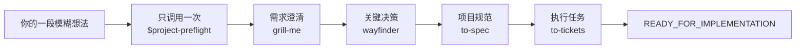

# Project Preflight

[English](README.md) | **简体中文**

[](https://github.com/NaCr05/project-preflight/actions/workflows/ci.yml)
[](LICENSE)
[](.codex-plugin/plugin.json)

> 只调用一次，把一段模糊的软件想法推进成有证据、可实施的计划。

Project Preflight 是一个只有一个公开入口的 Codex Plugin：`$project-preflight`。它会自动协调需求澄清、架构决策、规范生成和任务拆分。你不需要复制任何 Skill 指令，只需要回答问题和确认选择。

## 实际流程



进入每个阶段时，Project Preflight 都会告诉你当前使用的能力。英文和简体中文提示共用同一份路由契约：

```text
Project Preflight · Discovery — 正在使用 `grill-me`（Project Preflight 内置适配器）。你只需回答或确认。
```

专项 Skill 保存持久化证据后，会自动把控制权交还给 Project Preflight。随后它检查 Gate、原子更新 `.project/preflight.md`、提示下一个 Skill 并继续。流程只会因为等待你的回答、真实阻塞、你主动取消或已经就绪而暂停。

**[阅读完整流程 →](docs/workflow.zh-CN.md)**

## 安装

### 公共 Plugin 目录

Project Preflight 发布到公共 Plugin 目录后，可以在 ChatGPT 桌面应用的 Plugins 页面安装，或者在 Codex CLI 输入 `/plugins`。安装完成后请新建任务，让内置 Skills 在新会话中加载。参见 [OpenAI 官方 Plugin 指南](https://learn.chatgpt.com/docs/plugins)。

### 现在从 GitHub 源码安装

前提：已安装 Git、支持 `codex plugin` 的 Codex CLI，并且可以使用内置 `$plugin-creator` Skill。

仓库仍为私有状态时，Git 所使用的 GitHub 账号必须拥有仓库访问权限；仓库转为公开后不再需要这一条件。

1. 把 Plugin 克隆到个人 Plugin 源码目录：

```text
git clone https://github.com/NaCr05/project-preflight.git "$HOME/plugins/project-preflight"
```

2. 在 Codex 任务中，把已有目录登记到个人 Marketplace：

```text
Use $plugin-creator to add the existing Plugin at <绝对路径>/plugins/project-preflight to my personal marketplace. Do not scaffold or overwrite the Plugin.
```

3. 安装登记后的 Plugin：

```text
codex plugin add project-preflight@personal
```

4. 验证安装，然后新建一个 Codex 任务：

```text
codex plugin list
```

列表中应显示 `project-preflight@personal` 的状态为 `installed, enabled`，版本为 `0.3.1` 或更高。

### 升级源码安装

```text
git -C "$HOME/plugins/project-preflight" pull --ff-only
codex plugin add project-preflight@personal
codex plugin list
```

重新安装后请新建任务。`pull --ff-only` 遇到冲突的本地改动时会停止，不会覆盖你的内容。

### 卸载

```text
codex plugin remove project-preflight@personal
```

这会卸载 Plugin，但保留源码目录，方便审查或以后重新安装。

## 使用

新想法：

```text
Use $project-preflight. 我想做一个开源工具，它可以……
```

已有项目：

```text
Use $project-preflight 检查这个项目，并从最早缺少证据的 Gate 继续。
```

第一条消息可以只是一句很不成熟的想法，Project Preflight 不要求你先写计划。

## 四道 Gate

1. **问题清晰** — 用户、问题、价值、输入输出、MVP、非目标、假设和可量化成功标准清楚。
2. **决策就绪** — 会改变架构方向的未知项和可行性风险已解决，或明确为非阻塞。
3. **规范就绪** — 范围、行为、边界和验证方式足够明确，可以实施。
4. **执行就绪** — Ticket 是纵向、可测试、依赖清晰的，并从最薄的 tracer bullet 开始。

只有 Gate 4 通过后才会进入 `READY_FOR_IMPLEMENTATION`。终点是规范、Ticket、首个 tracer bullet、验证路径和剩余风险组成的实施交接，不是生产代码。

## 状态、安全与架构

`StateStore` 把受限 YAML 解析、推进、回退、验证、恢复和原子写入放在同一个 State lifecycle Interface 后面。`_contract.py` 是有限状态事实的 canonical registry；规范文档中的标记区块由它精确投影，并由 CI 检查。

Artifact Evidence 为 inline、本地 Markdown、GitHub Issue 和通用 URL 提供独立 Adapter。可选的远程检查共用一个 Safe Remote Fetch Module：固定已批准的公网地址、逐跳检查重定向、限制响应，并在跨域跳转时移除凭据。链接可访问不等于证据足以通过 Gate。

```text
skills/project-preflight/             公开编排入口与状态运行时
skills/project-preflight-grill-me/    内置需求澄清 Adapter
skills/project-preflight-wayfinder/   内置决策 Adapter
skills/project-preflight-to-spec/     内置规范 Adapter
skills/project-preflight-to-tickets/  内置任务拆分 Adapter
```

内部 Adapter 使用命名空间，避免与单独安装的 Skill 冲突。参见 [第三方声明](THIRD_PARTY_NOTICES.md)、[上游审查策略](docs/upstream-adapter-policy.md) 和 [ADR 0003](docs/decisions/0003-single-entry-automatic-orchestration-plugin.md)。

## 已验证与暂缓功能

| 能力 | 状态 |
|---|---|
| 单入口、自动编排、本地 Markdown happy path | 已验证 |
| Gate 1–4、回退、恢复、原子写入失败保护 | 已验证 |
| 英文与简体中文阶段提示 | 确定性测试通过 |
| GitHub Issue 与通用 URL 的只读安全检查 | 确定性测试通过；远程访问仍需显式开启 |
| 远程 tracker 发布 | 暂缓 |
| Python 原生调用 Skill | 运行时不提供；当前为指令驱动编排 |
| 公共 Plugin 目录上架 | 尚未发布 |

第一次完整的高推理 happy path 大约消耗 108k model tokens、10 分钟。`evals/budgets.json` 将同类运行的回归上限设为 130k tokens 和 12 分钟。这是回归警戒线，不是长期理想成本。

## 开发与验证

```text
python -m compileall -q skills evals tests
python -m unittest discover -s tests -v
python skills/project-preflight/scripts/sync_contract.py --check
python skills/project-preflight/scripts/preflight_state.py template --check skills/project-preflight/assets/preflight-template.md
python evals/run_behavior_evals.py list
```

发布前还要对仓库根目录运行 Codex Plugin validator，并对 `skills/` 下的五个 Skill 全部运行 Skill Creator 校验。

继续阅读：[贡献指南](CONTRIBUTING.md)、[安全策略](SECURITY.md)、[变更记录](CHANGELOG.md) 和 [产品规范](docs/product-spec.md)。

## 分支历史

已验证的显式 Handoff 实验保留在 `agent/handoff-state-lifecycle`。ADR 0003 只取代它的编排体验；已经验证的 State lifecycle、证据、回退和评测架构继续保留。

## 许可证

MIT，详见 [LICENSE](LICENSE)。
