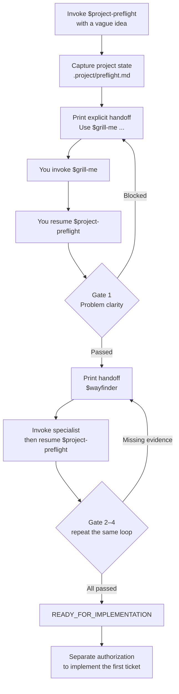

# Project Preflight Workflow

**English** | [简体中文](workflow.zh-CN.md)

This guide shows what happens after you invoke `$project-preflight` with a vague idea, where you participate, what the repository retains, and exactly where preflight ends.

## Route map



## At a glance

| Stage | Specialist capability | Your role | Durable result | Exit condition |
|---|---|---|---|---|
| `IDEA` | Project Preflight | Provide the initial idea | Captured idea and state file | Idea pointer exists |
| `DISCOVERY` | `grill-me` | Explicitly invoke it and answer one focused product question at a time | Problem-clarity evidence | Gate 1 passes |
| `DECISION` | `wayfinder` | Explicitly invoke it and choose among options and trade-offs | Decision map or justified `not-required` | Gate 2 passes |
| `SPECIFICATION` | `to-spec` | Explicitly invoke it, confirm testing seams, and review scope | Canonical spec | Gate 3 passes |
| `TICKETING` | `to-tickets` | Explicitly invoke it and review granularity and blocking edges | Approved tracer-bullet tickets | Gate 4 passes |
| `READY_FOR_IMPLEMENTATION` | Project Preflight | Decide whether to start coding | Precise implementation handoff | Preflight is complete |

## The handoff loop

Project Preflight does not secretly chain planning Skills. At every specialist Stage it:

1. validates the current state and checks the required Skill in the active catalog;
2. prints one exact command beginning with `Use $grill-me`, `Use $wayfinder`, `Use $to-spec`, or `Use $to-tickets`;
3. stops so you can invoke that Skill explicitly;
4. asks the upstream Skill to save or identify its durable result and then return you to `$project-preflight`;
5. evaluates one Gate only after you resume.

This visible pause is intentional. A Skill directory on disk is not proof that the current session can invoke it, and several upstream Skills require explicit user invocation.

## 0. Capture the idea and initialize state

You start with something like:

```text
Use $project-preflight.

I want to build an open-source agent that watches technical creators
and tells me what matters. Do not write production code yet.
```

Project Preflight inspects the repository, validates any existing state, checks the dependency required for the current stage, and creates or updates:

```text
.project/preflight.md
```

The state file records:

- current and previous stage;
- four gate statuses and their evidence;
- blockers and the next action;
- dependency availability;
- pointers to the canonical idea, decision map, spec, and ticket set.

It stores pointers rather than copying every artifact into one large file.

## 1. Discovery: make the problem clear

At `DISCOVERY`, Project Preflight prints an exact `$grill-me` handoff and stops. You invoke it explicitly and later resume `$project-preflight`. Expect a conversation, not an instant generated plan. Questions are asked one at a time and focus on decisions only you can make; discoverable repository facts should be inspected rather than asked back to you.

Discovery establishes:

- target user and situation;
- current problem and promised value;
- primary inputs and outputs;
- why an agent is or is not appropriate;
- MVP boundary and explicit non-goals;
- measurable success criteria;
- material assumptions.

### Gate 1: problem clarity

Gate 1 passes only when durable evidence covers all of those fields. A polished elevator pitch alone is not enough. If evidence is missing, the project stays in `DISCOVERY` and reports the missing item as the next action.

## 2. Decisions: resolve architecture-reversing unknowns

At `DECISION`, Project Preflight prints an exact `$wayfinder` handoff and stops. You invoke it explicitly, let Wayfinder persist the decision map, and resume `$project-preflight`. Wayfinder names the destination, maps the known decision frontier, and resolves decision tickets rather than implementation tasks.

Typical questions include:

- Can the required data actually be accessed within cost and rate limits?
- Is this a deterministic workflow, one agent, or multiple agents?
- Will it run locally, on a server, or on a schedule?
- What state, storage, memory, model, tool, and interface boundaries apply?
- What are the privacy, security, compliance, and failure-handling constraints?

Large efforts may take several sessions. A map can be created first, then one major decision resolved per session. Research or a disposable prototype is allowed only when it supplies evidence for a decision; it does not become speculative production code.

### Gate 2: decision readiness

Gate 2 passes when architecture-reversing choices have durable resolutions and all remaining unknowns are explicitly non-blocking. A genuinely small project may use `decision_map: not-required`, but the evidence must explain why no map is justified.

## 3. Specification: freeze the approved project

At `SPECIFICATION`, Project Preflight prints an exact `$to-spec` handoff and stops. You invoke it explicitly, save or link the canonical spec, and resume `$project-preflight`. This stage synthesizes what has already been discussed; it does not reopen discovery or invent extra features. Before publishing the spec, you may be asked to confirm the highest useful testing seam.

The canonical spec normally covers:

- problem and user-facing solution;
- observable user stories or equivalent behavior;
- stable implementation and interface decisions;
- external-behavior testing decisions;
- MVP and out-of-scope work;
- success criteria, edge cases, and failures;
- open questions, none of which may block ticketing.

### Gate 3: specification readiness

Gate 3 passes when a reviewer can classify any proposed feature as in scope or out of scope without inventing a new product decision. A missing decision sends the workflow back to `DECISION`; incomplete specification detail stays in `SPECIFICATION`.

## 4. Ticketing: create a safe execution frontier

At `TICKETING`, Project Preflight prints an exact `$to-tickets` handoff and stops. You invoke it explicitly and resume `$project-preflight` after the ticket frontier is durable. The capability first proposes a numbered breakdown and asks you to review:

- whether each ticket is too large or too small;
- whether any tickets should be merged or split;
- whether every blocking edge represents a genuine prerequisite.

After approval, tickets are published to the configured tracker. In local Markdown mode they are stored as one file per ticket under a local issue directory.

Good tickets are narrow but complete vertical slices. The first unblocked ticket should be a tracer bullet: the smallest end-to-end path that produces independently verifiable value.

### Gate 4: execution readiness

Gate 4 passes when tickets point back to the canonical spec, have observable acceptance criteria, form a valid dependency frontier, preserve scope, identify verification, and include at least one unblocked tracer bullet.

## 5. The endpoint: `READY_FOR_IMPLEMENTATION`

Preflight ends with all four gates passed and a valid state file. The handoff names:

- the canonical spec;
- the approved ticket set;
- the first unblocked tracer-bullet ticket;
- commands or evaluations that verify it;
- non-blocking residual risks.

This is not “the product is implemented.” It means the next implementation action is bounded, reviewable, and testable. Coding begins only after a separate instruction such as:

```text
Implement the first unblocked tracer-bullet ticket.
Follow the canonical spec and do not include later tickets.
```

## Control points and expected pauses

Project Preflight does not invoke an upstream Skill or autonomously cross several Gates in one run. Every specialist Stage ends with a user-invoked Handoff; every Gate evaluation begins only after an explicit return.

At every checkpoint, expect four fields:

```text
Current Stage
Gate Evidence
Blockers
Next Action
```

If a dependency is missing, tracker publication is unauthorized, evidence conflicts, or state validation fails, the workflow pauses at the current stage instead of silently degrading.

## Resume later

Because state lives in the repository, a later session can continue with:

```text
Use $project-preflight to resume this project's preflight.
```

The agent validates `.project/preflight.md` through the State lifecycle module, checks its Artifact Evidence pointers, and resumes the earliest unsupported Gate rather than replaying completed work. Invalid candidate updates never replace the last valid file.

## Roll back when reality changes

The route is reversible. If research or implementation proves a core assumption false, Project Preflight regresses to the earliest affected stage. For example:

```text
API cannot provide the required data
→ return to DECISION
→ invalidate Gates 2–4
→ keep the old spec and tickets as non-authoritative history
```

After the replacement decision is approved, the spec and tickets are revised and their gates evaluated again.
