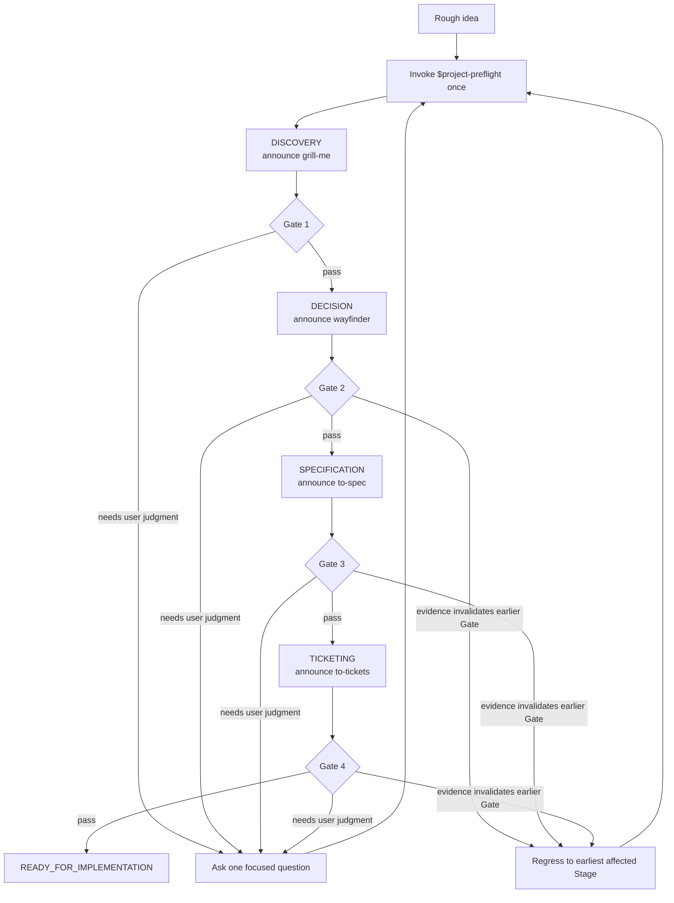

# Project Preflight workflow

**English** | [简体中文](workflow.zh-CN.md)

## One entry, automatic stages



The user does not operate the arrows. Project Preflight derives the current directive, announces the active capability, follows the bundled adapter, evaluates its durable result, persists one transition, and continues.

## What the user sees

Each Stage starts—or resumes after interruption—with a compact banner:

```text
Project Preflight · Decision — Using `wayfinder` (bundled Project Preflight adapter). Just answer or confirm.
```

The banner appears once per Stage entry or resume, not before every question. Interviews ask one consequential question at a time. Defaults include a short rationale and require user confirmation when they change the product or architecture.

## Stage journey

| Stage | Active capability | User experience | Durable result | Pass condition |
|---|---|---|---|---|
| `IDEA` | Project Preflight | Share one rough paragraph | Original idea | Enough context to begin discovery |
| `DISCOVERY` | `grill-me` | Answer focused questions | Idea/discovery contract | Gate 1: problem clarity |
| `DECISION` | `wayfinder` | Approve or change important defaults | Decision map | Gate 2: decision readiness |
| `SPECIFICATION` | `to-spec` | Resolve only material spec gaps | Canonical spec | Gate 3: specification readiness |
| `TICKETING` | `to-tickets` | Review scope-preserving slices | Ticket frontier | Gate 4: execution readiness |
| `READY_FOR_IMPLEMENTATION` | Project Preflight | Review the implementation handoff | Valid state and artifact pointers | Preflight ends |

## Pauses and resumes

Project Preflight pauses when it needs a user answer, external authorization, unavailable capability, contradictory evidence, or explicit cancellation. On resume it validates `.project/preflight.md`, announces the current Skill again, and continues without asking the user to paste a command.

## Regression

If new evidence overturns an assumption, Project Preflight names the invalidated domain artifact in a Stage Outcome. `PreflightSession` derives the earliest affected Stage; callers do not select it directly. Affected Gates become `invalidated`, later artifacts remain visible but non-authoritative, and the matching adapter is announced and resumed automatically.

## Endpoint

`READY_FOR_IMPLEMENTATION` requires all four Gates and a valid state file. The final handoff names the canonical spec, approved tickets, first unblocked tracer bullet, verification commands or evaluations, and residual non-blocking risks. Production implementation begins only after a separate or already explicit request.
