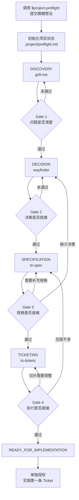

# Project Preflight 完整流程

[English](workflow.md) | **简体中文**

本指南说明：当你带着一个模糊想法调用 `$project-preflight` 后会发生什么、你需要在哪些地方参与、仓库会留下哪些产物，以及 Preflight 的准确终点在哪里。

## 路线图



## 一览表

| 阶段 | 专项能力 | 你的职责 | 持久化产物 | 离开条件 |
|---|---|---|---|---|
| `IDEA` | Project Preflight | 提供初始想法 | Idea 和状态文件 | Idea 指针存在 |
| `DISCOVERY` | `grill-me` | 每次回答一个聚焦的产品问题 | 问题清晰度证据 | Gate 1 通过 |
| `DECISION` | `wayfinder` | 在选项与权衡之间作出判断 | Decision Map，或有理由的 `not-required` | Gate 2 通过 |
| `SPECIFICATION` | `to-spec` | 确认测试 seam 并审查范围 | 规范 Spec | Gate 3 通过 |
| `TICKETING` | `to-tickets` | 审查 Ticket 粒度和依赖关系 | 已批准的 Tracer Bullet Tickets | Gate 4 通过 |
| `READY_FOR_IMPLEMENTATION` | Project Preflight | 决定是否正式开始编码 | 精确的实施交接 | Preflight 完成 |

## 第 0 步：记录想法并初始化状态

你可以这样开始：

```text
使用 $project-preflight。

我想做一个开源 Agent，监控技术创作者并告诉我哪些内容真正重要。
现在不要编写生产代码。
```

Project Preflight 会检查仓库、验证已有状态、检查当前阶段所需依赖，然后创建或更新：

```text
.project/preflight.md
```

状态文件记录：

- 当前阶段与上一阶段；
- 四个 Gate 的状态和证据；
- 阻塞项与下一步；
- 依赖是否可用；
- Idea、Decision Map、Spec 和 Tickets 的规范指针。

它保存的是产物指针，不会把全部内容重复复制到一个超长文件中。

## 第 1 步：Discovery——把问题想清楚

Project Preflight 将 `DISCOVERY` 路由给 `grill-me`。这里是一段对话，而不是瞬间生成的完整方案。问题原则上一次只问一个；能够从仓库发现的事实应由 Codex 自己检查，真正需要你决定的问题才会交给你。

Discovery 会明确：

- 目标用户和场景；
- 当前问题与承诺价值；
- 主要输入和输出；
- 为什么需要或不需要 Agent；
- MVP 边界和明确的 Non-Goals；
- 可衡量的成功标准；
- 重要假设。

### Gate 1：问题清晰度

只有持久化证据覆盖以上内容时，Gate 1 才会通过。一段漂亮的 30 秒介绍本身并不够。如果缺少证据，项目会停留在 `DISCOVERY`，并把缺失项列为下一步。

## 第 2 步：Decision——解决可能推翻架构的未知项

Project Preflight 将 `DECISION` 路由给 `wayfinder`。Wayfinder 先定义规划终点，再绘制已知 Decision Frontier；这里处理的是决策任务，不是编码任务。

常见问题包括：

- 所需数据能否在成本和 Rate Limit 内获取？
- 应使用确定性 Workflow、单 Agent，还是 Multi-Agent？
- 项目在本地、服务器还是定时任务中运行？
- State、Storage、Memory、Model、Tool 和 Interface 的边界是什么？
- 隐私、安全、合规与失败处理有哪些限制？

大型项目可能需要多个 Session：先建立 Decision Map，再逐项解决重大决策。只有在 Prototype 能为某项决策提供证据时，才允许制作明确可丢弃的原型；它不能偷偷演变为生产代码。

### Gate 2：决策就绪度

当可能推翻架构的选择都有持久化结论，且所有剩余未知项都被证明不会阻塞后续工作时，Gate 2 才会通过。真正很小的项目可以使用 `decision_map: not-required`，但必须记录不需要 Decision Map 的理由。

## 第 3 步：Specification——冻结已批准的项目

Project Preflight 将 `SPECIFICATION` 路由给 `to-spec`。这一阶段综合已有讨论，不重新开启需求发散，也不自行添加功能。在正式生成 Spec 前，它可能请你确认最高层、最有价值的测试 seam。

规范 Spec 通常包括：

- 问题与用户视角的解决方案；
- 可观察的 User Stories 或等价行为；
- 稳定的实现与接口决策；
- 基于外部行为的测试决策；
- MVP 与 Out of Scope；
- 成功标准、边界情况与失败路径；
- 不会阻塞 Ticketing 的开放问题。

### Gate 3：规格就绪度

当审查者不需要发明新产品决策，就能判断任意新功能属于范围内还是范围外时，Gate 3 才会通过。缺少重大决策会退回 `DECISION`；只是规格细节不完整则留在 `SPECIFICATION`。

## 第 4 步：Ticketing——建立安全的执行 Frontier

Project Preflight 将 `TICKETING` 路由给 `to-tickets`。它会先提出带编号的拆分方案，请你审查：

- 每条 Ticket 是否过大或过小；
- 哪些 Ticket 应合并或继续拆分；
- 每条阻塞关系是否真的是必要前置条件。

你批准后，Tickets 才会发布到配置好的 Tracker。本地 Markdown 模式下，每条 Ticket 会作为单独文件保存在本地 Issues 目录。

好的 Ticket 是窄而完整的纵向切片。第一条未阻塞 Ticket 应该是一枚 Tracer Bullet：能够产生独立、可验证价值的最短端到端路径。

### Gate 4：执行就绪度

只有当 Tickets 指向规范 Spec、具有可观察验收标准、构成有效依赖 Frontier、不扩大范围、包含验证方式，并且至少存在一条未阻塞的 Tracer Bullet 时，Gate 4 才会通过。

## 第 5 步：终点 `READY_FOR_IMPLEMENTATION`

四个 Gate 全部通过且状态文件验证成功后，Preflight 结束。最终交接会明确：

- 规范 Spec；
- 已批准的 Ticket 集合；
- 第一条未阻塞 Tracer Bullet；
- 用于验证它的命令或评测；
- 不阻塞实施的剩余风险。

这不代表“产品已经实现”。它表示下一步实施已经有明确边界、可以审查、可以测试。只有收到单独指令后，编码才开始：

```text
实施第一条未阻塞的 Tracer Bullet Ticket。
严格遵守规范 Spec，不要包含后续 Tickets。
```

## 控制点与预期暂停

Project Preflight 不会在一次无人确认的执行中连续跨越多个 Gate。当前采访可以持续到一个问题得到解决，但作出 Gate 结论后，它会先向你提供可审查状态，再路由到下一阶段。

每个检查点应当看到四项内容：

```text
Current Stage
Gate Evidence
Blockers
Next Action
```

如果依赖缺失、Tracker 发布未获授权、证据冲突或状态验证失败，流程会停在当前阶段，而不是静默降级。

## 稍后恢复

由于状态保存在仓库中，后续 Session 可以直接说：

```text
使用 $project-preflight 恢复这个项目的 preflight。
```

Agent 会验证 `.project/preflight.md`、检查产物指针，并从最早缺少证据的 Gate 继续，不会重做已完成工作。

## 现实变化时回退

这条路线是可逆的。如果研究或实施证明核心假设错误，Project Preflight 会回到最早受影响的阶段。例如：

```text
API 无法提供所需数据
→ 返回 DECISION
→ 将 Gate 2–4 标记为 invalidated
→ 保留旧 Spec 和 Tickets，但只作为非规范历史记录
```

替代决策获批后，再重新修订 Spec 和 Tickets，并重新评估相应 Gate。
