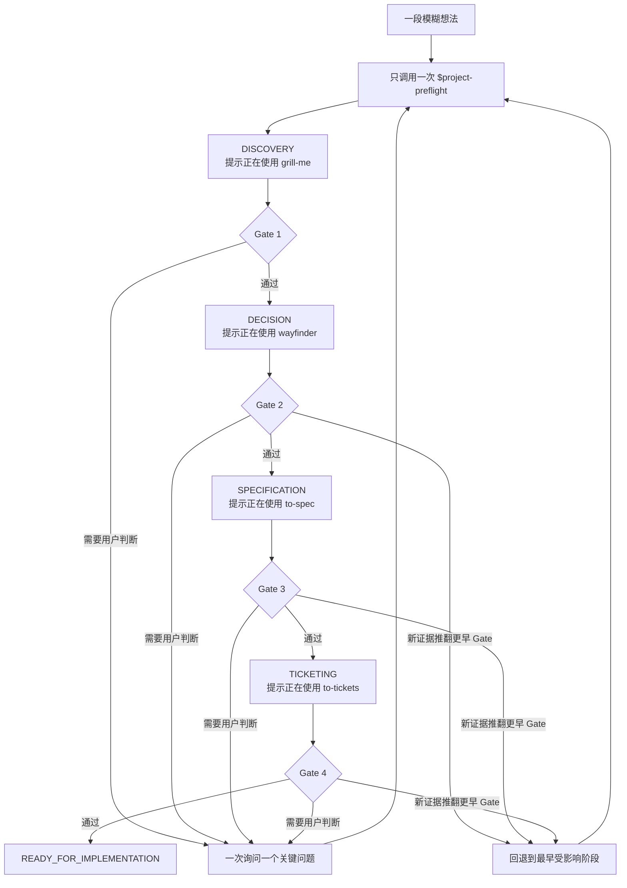

# Project Preflight 完整流程

[English](workflow.md) | **简体中文**

## 单入口，自动推进



用户不需要自己操作图里的箭头。Project Preflight 会推导当前指令、提示正在使用的能力、执行内置适配器、检查持久化结果、原子推进一次状态，然后自动继续。

## 用户会看到什么

每次进入新阶段，或任务中断后恢复时，都会出现一条简短提示：

```text
Project Preflight · Decision — 正在使用 `wayfinder`（Project Preflight 内置适配器）。你只需回答或确认。
```

同一个连续访谈里不会每个问题都重复提示。访谈一次只问一个真正重要的问题；会改变产品或架构的推荐默认项会说明理由，并等待你的确认。

## 各阶段

| 阶段 | 当前能力 | 你的体验 | 持久化结果 | 通过条件 |
|---|---|---|---|---|
| `IDEA` | Project Preflight | 说一段早期想法 | 原始想法 | 足够开始澄清 |
| `DISCOVERY` | `grill-me` | 回答聚焦问题 | Idea / discovery contract | Gate 1：问题清晰 |
| `DECISION` | `wayfinder` | 接受或调整关键默认项 | Decision Map | Gate 2：决策就绪 |
| `SPECIFICATION` | `to-spec` | 只补齐真正影响规范的缺口 | Canonical Spec | Gate 3：规范就绪 |
| `TICKETING` | `to-tickets` | 审查不扩张范围的纵向切片 | Ticket Frontier | Gate 4：执行就绪 |
| `READY_FOR_IMPLEMENTATION` | Project Preflight | 查看实施交接 | 有效状态与产物指针 | 预检结束 |

## 暂停与恢复

流程只会在需要你的回答、外部授权、能力不可用、证据矛盾或你主动取消时暂停。恢复后，它会验证 `.project/preflight.md`，再次提示当前 Skill，并从原位置继续，不要求你粘贴任何命令。

## 回退

如果新证据推翻旧假设，Project Preflight 会在 Stage Outcome 中指出失效的领域 artifact，由 `PreflightSession` 推导最早受影响的阶段，调用方不直接选择。受影响 Gate 标记为 `invalidated`，后续产物继续保留但不再是当前权威；对应适配器会被自动提示并恢复。

## 终点

只有四道 Gate 全部通过且状态文件有效，才会进入 `READY_FOR_IMPLEMENTATION`。最终交接会列出 canonical spec、已批准 Ticket、首个未阻塞 tracer bullet、验证命令或评测，以及非阻塞剩余风险。生产实现需要另一条明确请求，或用户早已明确授权在 readiness 后继续。
